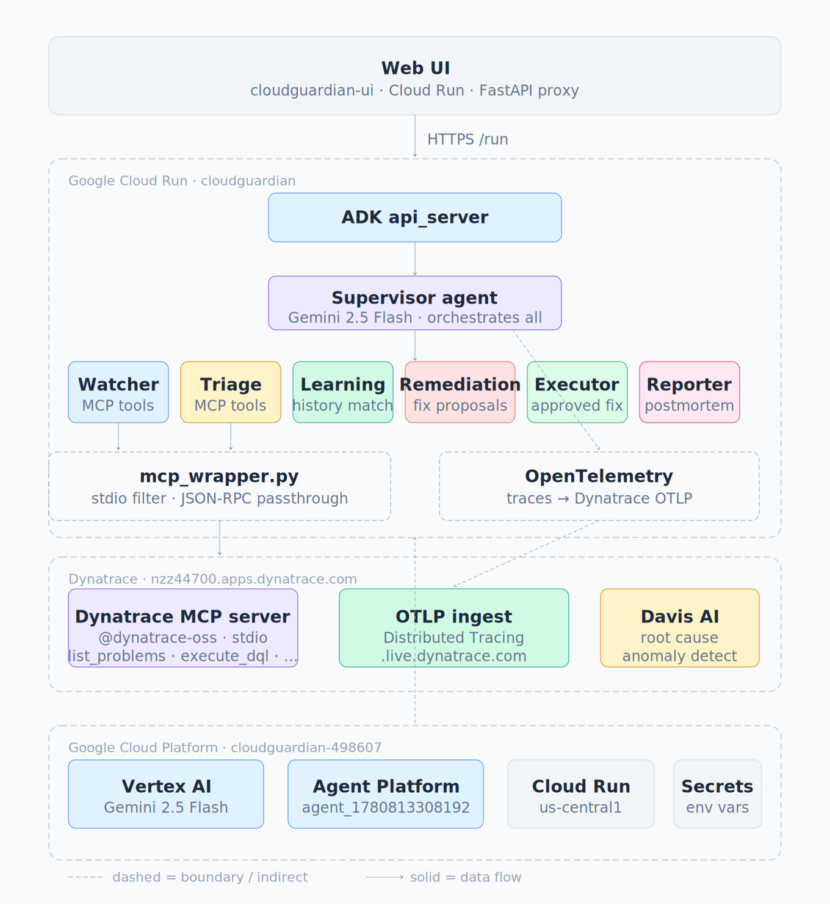

# CloudGuardian 🛡️

**Autonomous Reliability Engineer powered by Google Cloud ADK + Dynatrace MCP**

Built for the Google Cloud Rapid Agent Hackathon — Dynatrace Track

## What it does
CloudGuardian is a 7-agent autonomous system that monitors your 
infrastructure via Dynatrace, investigates incidents, proposes 
remediations with human approval gates, executes fixes, and 
generates postmortems automatically.

## Key Capabilities

✓ Predict outages before they happen
✓ Investigate incidents using Dynatrace MCP
✓ Match against historical incidents
✓ Simulate remediation actions
✓ Require human approval for critical changes
✓ Execute operational fixes
✓ Verify recovery automatically
✓ Generate postmortems

## Architecture


- **Supervisor** — orchestrates the full workflow
- **WatcherAgent** — monitors Dynatrace for active problems
- **TriageAgent** — investigates root cause using DQL queries
- **LearningAgent** — matches against historical patterns
- **RemediationAgent** — proposes fixes with risk/success scores
- **ExecutorAgent** — executes approved remediations
- **ReporterAgent** — generates incident postmortems

## Tech Stack
- Google Cloud ADK 2.1.0
- Gemini 2.5 Flash
- Dynatrace MCP Server (stdio)
- Vertex AI Agent Platform
- Cloud Run
- OpenTelemetry → Dynatrace

## Live Demo
- Web UI: https://cloudguardian-ui-118329824935.us-central1.run.app

- Demo Video: https://youtu.be/800y9S81vOM

## Setup
```bash
pip install -r requirements.txt
cp .env.example .env  # add your tokens
adk web
```

## License
MIT
